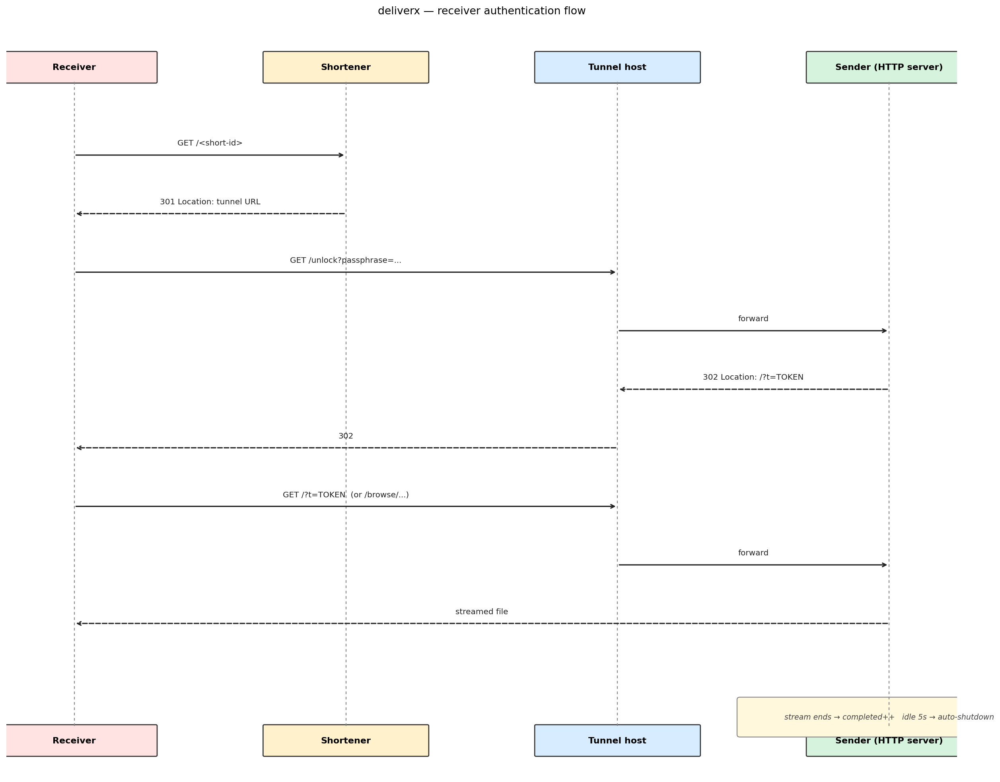

# DeliverX

A single-file Python script for ad-hoc, password-protected file transfers between two machines that aren't on the same network. The sender exposes a temporary HTTP endpoint through a free public SSH tunnel; the receiver pastes a short URL and a 4-word passphrase to pull the file.

No account, no upload to a third-party storage service, no daemons left running — once the transfer is done (or 30 minutes have elapsed) the sender shuts itself down.

DeliverX is inspired by such tools as 
- croc (https://github.com/schollz/croc)
- wush (https://github.com/coder/wush)

with main differences:

- deliverx doesnt need to be installed on either side, its a single python script with zero dependencies (just Python 3)
- it can be run by any user (non-root)
- can deliver both a single file and contents of entire directory
- uses available public tunnel services 
- works with every version of Python 3.6 > latest

---
## Quick start

Download the script from this repo

```
curl -L -o deliverx https://tinyurl.com/perfecto25-deliverx
```

chmod +x deliverx or run directly with 

```
python3 deliverx send myfile
```


You need deliverx both on sender and receiver side.


```bash
# Sender — file or directory
./deliverx send /path/to/myfile.zip
./deliverx send ./my_folder

# Receiver
./deliverx receive
```

The sender prints the URL and passphrase, both highlighted in yellow:

```
----------------------------------------------------
  Public URL : https://tinyurl.com/2agfhzta
  Passphrase : violet-oasis-zephyr-meadow
  Full URL   : https://czggh-100-35-119-94.run.pinggy-free.link
  Local URL  : http://host:8443/
  File       : myfile.zip
----------------------------------------------------
```

Tell the receiver both. They paste the URL and the passphrase; the file streams over the tunnel. Directory transfers show the receiver an indexed list — they can pick by number, range (`1,3-5`), or `all`.

By default, deliverx will open a local port 8443 that port forwards to the tunnel provider

To use a different port, add the --port flag

```
./deliverx send myfile --port 12999
```

## How it works

1. **SSH tunnel** — the sender uses a list of public tunnel services (like serveo.net, pinggy or localhost.run). The sender runs `ssh -R 80:localhost:<port> serveo.net` and parses the public URL out of the SSH session output.

2. **URL shortener** — the public tunnel URL is long and IP-like; deliverx posts it to tinyurl / is.gd / v.gd in order, verifies that the result actually 30x-redirects to the tunnel host (rejecting anti-phishing interstitials), and prints the working short URL.
3. **Passphrase** — a 4-word passphrase is generated and stored only as a PBKDF2-SHA256 hash. The plaintext never lives on disk.
4. **HTTP server** — `http.server.ThreadingHTTPServer` listens on the local port and exposes:
   - `GET /` — login form (or auth'd directory listing / single file)
   - `GET /unlock?passphrase=…` — verifies the passphrase, then 302 to `/?t=TOKEN`
   - `GET /?t=TOKEN` — single-file download or root index
   - `GET /browse/...?t=TOKEN` — directory navigation / file download
5. **Receiver** — manually resolves the short URL by reading the `Location` header (using a Mozilla UA to skip shortener anti-phishing pages), then talks to the tunnel directly with a curl-style UA so pinggy's web debugger passes requests through.
6. **Auto-shutdown** — the server tracks active and completed downloads. Once at least one transfer has completed and nothing has been streamed for 5 seconds, the server stops itself. There is also a hard **30-minute session cap** — the tunnel will never stay up longer than that, even mid-transfer.

## Components

```
SENDER                          INTERNET                          RECEIVER
deliverx send                                                     deliverx receive
   |                                                                    |
   +-- HTTP server :8443 <----+                                          |
   |                          |                                          |
   +-- ssh -R reverse-tunnel -+--> serveo / pinggy <-- HTTPS GET --------+
   |                                                                    |
   +-- POST shorten API ---------> tinyurl / is.gd <---- GET ------------+
                                                            (resolves URL)
```

## Authentication flow




## Why no third-party uploader

This script is for one-off transfers where you don't want files sitting on someone else's storage. Everything stays on the sender's box; the public tunnel only forwards traffic, and is torn down at the end of the session.

## Limitations

- Tunnel providers are free services and go up and down. deliverx tries serveo and pinggy in order.
- Some tunnel domains end up on shortener abuse blocklists; tinyurl in particular has rejected `serveousercontent.com` URLs. The fallback chain is tinyurl → is.gd → v.gd.
- Pinggy's free tier shows a web debugger UI to browser User-Agents. The receiver uses a curl-style UA to bypass it.
- Hard session cap is 30 minutes — restart the sender for longer transfers.

## Debug flags

| Env var | Effect |
|---|---|
| `DELIVERX_DEBUG=1` | Trace receiver's URL resolution and authentication |
| `DELIVERX_DEBUG_TUNNEL=1` | Stream raw tunnel SSH output as it arrives |
| `DELIVERX_DEBUG_SHORTEN=1` | Show each shortener attempt + verification step |

## Requirements

- Python 3.6+
- `ssh` and `openssl` on `$PATH`
- Outbound TCP/22 (or 443 for pinggy) to the chosen tunnel host

## Testing

to test both the tunnel and URL shortener providers, run test_health.py which will test each service and different combinations of tunnels and shorteners